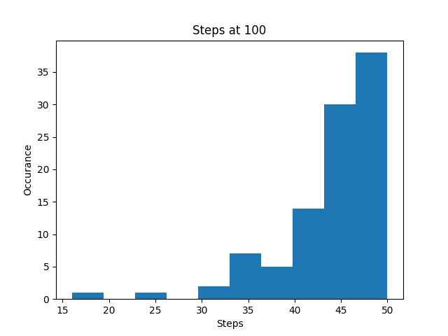
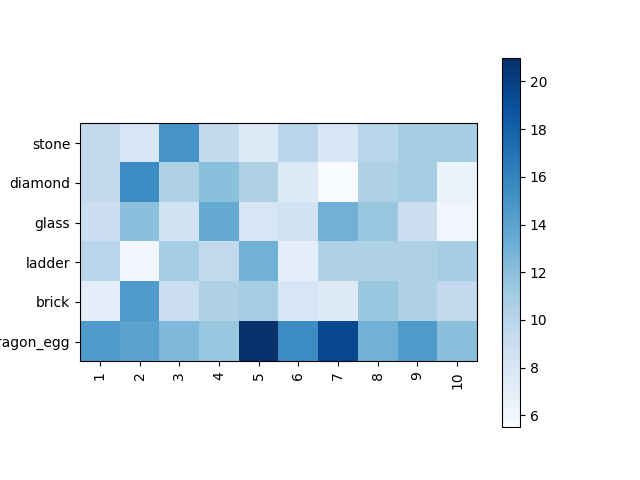
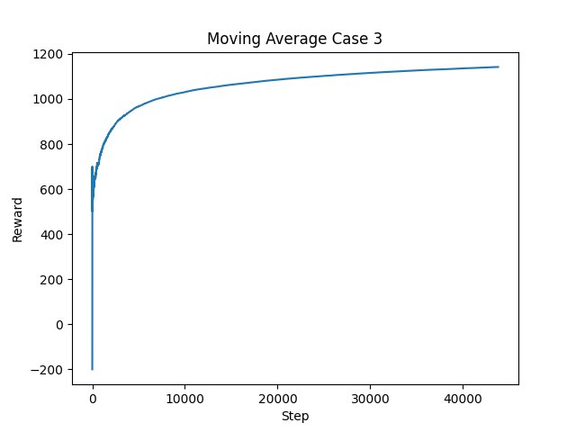

## Video

## Project Summary

The Library of Alexandria attempts to sort and optimize the retrieval for objects in an unpredictable enviornment. The problem was motivated by a librarian, attempting to store items with unlimited time, and retreive in a limited amount of time (presumably to keep their clients happy). Therefore, we attempted to create a problem that, in Minecraft, would simulate a similar situation -- with chests to represent storage spaces and inventory items as items to store. Our agent will try to distribute the item, then be measured based on their distribution. 

The basic idea of the problem follows this:
<ol>
    <li>The agent recieves some items to distribute, and distributes them in the enviornment</li>
    <li>The agent then retrieves the items, and is scored based on
        <ol>
            <li> Number of steps to retreieve the request </li>
            <li> Number of items from the request retrieved </li>
        </ol>
    </li>
</ol>

### Problem Setup 
I will describe the problem setup in 4 parts:
1. The Enviornment (where this problem will occur)
2. The Requester (the representation of the user)
3. The Rewards (how the performance of the actors will be determined)
4. The Agent (What we designed/our approach to solving this problem)

### Environment Setup
The enviornment, will represent the "Library".


As you can see, we created a linear row of chests to represent this enviornment. There agent can stand in the second row only, with 3 "spots" the agent may reside in. 
These are as follows
1. The Grey (Iron) Blocks denotes that a run has completed, and acts as the "end mission" signal to our algorithm
2. The Green (Emerald) Blocks denotes the "result" chest, where requested items, if retrieved, will be deposited after the items have been retrieved
3. The Blue (Diamond) Blocks denotes the "library" chest, where the librarian will deposit the items to distribute for storage.

The Enviornment is held constant as shown in the image above, with 10 "Library" chests, and a single "Result" chest to the right of the rightmost "Library" chests, and an iron block to the right of that result chests. Therefore the enviornment will always be shown as thus (D = Library Chest, E = Result Chest, I = End Chest):

> [D, D, D, D, D, D, D, D, D, D, E, I]

With the current definition, this problem is trivial. However, our problem also has a bit of an issue -- when distributing in certain chests, they may have a chance, when accessed, the chest will not properly open, therefore, sealing the contents and preventing them from being retrieved. This moves the problem from being trivially easy to a problem to a problem warranting Machine Learning, which we will later demonstrate after explaining the rest of the setup.    

The Agent is then spawned in on the Emerald Block, with an inventory full of items to distribute, which it will need to distribute, then recieve a request from the "Requester" agent, which will represent the user making requests of items. 

### Requester Setup
Our Problem has a requester setup to simulate the user. 

The distribution is simulated as thus:  
Let there be n items to be retrieved, and m possible items to be retrieved at once. On initialization an array of m sorted, random numbers. Whenever a "request" is made, n random numbers are generated, and whichever "range" the number falls under will be the item requested. This will make up the request, which will be sent to the librarian to be retrieved from their distribution. 
  
In Pseudo Code:
1. Generation: 
```
items = sorted([random() for _ in range(numberItems)])
```
2. Request:
```
result = []
for _ in requestAmount:
    number = random()
    for i in items:
        if number < i: 
            result.append(item[i])
            break
return result
```

That request will be then retrieved, and the performance of the agent be measured by requesting for rewards based on what was retrieved, and how many steps it took

### Rewards Setup
The rewards will be provided two parameters, the number of steps it took to retrieve the request, and what was requested. Some items will not be retrieved, as some items may be locked in an unopenable chest, therefore there are those two parameters, to represent time, and what was not retrieved. The more time, the less reward. If some items fail to retrieve, the reward will automatically be set to some negative value, as therefore the agent failed to get the full request

The reward was then decided to be thus: 
```
failed = notRetrieved.length()

if failed == 0:
    return 1500 - (100 * stepsTaken) 
return -100 * failed
```
This makes up the rewards returned as a benchmark from the Requester.py file, which acts as a standard measure of how each run performs.

### Agent Setup
With the enviornment setup, we now arrive at the final part of the puzzle. We provide our agent, the solution that we create with the enviornment, and an interface to communicate with to get a reward, given its ability to retrieve items. The details of the enviornment setup, such as the exact percentage of times a chest will be opened, along with the distribution of the requests will be hidden, and will be the informations the agent must learn.

The process goes as thus: 

1. Setup Enviornment and Agent
2. Agent Distributes the items
3. Agent Retrieves the items, saving the steps and items retrieved
4. Agent Gets score based off performance

## Approaches
For our approach to solving this problem we employed PPO reinforcement learning, using RLib. To prove the efficacy of our approach, and the  we compared this against our benchmark employing the idea of the law of large numbers and placing the items in a algorithimic manner based on a simulated 10k requests by our "pateron" distribution. In our evaluation section we will go in depth in how our benchmark faired against our PPO algorithim and the precise improvements PPO had over our trivial brute force algorithim. 


### PPO reinforcement learning approach

In order to implement PPO reinforcement for this problem we first definied what the observation space for our agent would be. We decided that the observation space would consist of two main details:

1. The item the agent is about the place
2. All the items placed in the chests currently an their positions

### Encoding and Enviornment Setup
At first we created a 2 dimesional observation space where the items were assigned a number ex. stone=1, diamond=2, glass=3 so that we could represent the item as a integer in the observation space. The 2d observation space followed the following dimesions

```
(number_of_chests + 1, number_of_chest_slots) 
```

The reason we have number_of_chests + 1 rather than number_of_chests in our observation space is to hold the item the agent is about to place next we treat this item as an entirely new chest whose first position is filled in with the one hot encoded item that is to be placed next all other spots in this chest are always empty. This allowed us to maintain using a linear model and also eliminated the need to generate preprocessing or a custom observation space dimensions with little cost on training.

As seen in the image below our observation space was initially mapped as an array of the values below.


After some research on one-hot encoding and a meeting with the TA we realized instead of assigning items to decimal numbers as the 2d observation space required we treat the items as one-hot encoded integers ex. stone=[1,0,0], diamond=[0,1,0], glass=[0,0,1]. This would improve our learning rate since our labels were non ordinal. This expanded our observation space to a three dimensional space. Where the new dimesions were

```
(number_of_chests + 1, number_of_chest_slots, unique_item_onehot) 
```

As seen in the image below our observation space ended up mapping to a 3d space.


Once we decided our observation space we decided our action space. For this we essentially let the agent select a chest to put the item it is holding. Once at the chest it places the item in the closest empty slot in its observation space. We avoided giving individual steps like move left and move right and place object since our goal with the agent was not to navigate the environment but to place the items in the best slots.
```
self.action_space = Discrete(number_of_chests)

```

'''

The idea of figuring out the best slots is where our reward function plays its role. The agent recieves no reward until it has placed all the items once it has placed all the items which means our PPO algorithim has to deal with both sparse, delayed, and episodic rewards. The agent then runs a simple retrival algorithim psuedocode shown below which retrives items based on the distribution the requester has in the project summary. 

<pre>
    <code>
        for item_id, num_retrieve in input.items(): # loop through the request
                pq_items = sorted([i for i in self._itemPos[item_id]])
                while num_retrieve > 0: # get all items requested of an item type
                    #look through chests agent has been tracking to find optimal chest
                    toConsider = pq_items.pop()
                    chest = self._chestContents[toConsider]
                    action_plan.append((toConsider, item_id, toRetrieve))
                    result[item_id] += toRetrieve
                    num_retrieve -= toRetrieve
        #order the way the retrival happens so the agent hits the closer chests first
        action_plan = sorted(action_plan, key=lambda x: x[0])
    </code>            
</pre>

The rewards were calculated the same way as described in the project summary with one caveat. What we realized when implementing this was that after some training time our agent was taking a very long time to place the items. After some investigation we realized our agent was always finding the closest chest to be ideal for every item so in order to disuade the agent to try to place an item into a chest that is already full we attributed a  -5 reward when the agent fails to place the item.


### Benchmark Approach
Our benchmarks that we compared our approach against were both algorithmic designs that were given the same setup as our solution, with similar information provided (an interface to get reward and requests) whose performance will be compared against our solution. A key difference was that the benchmark was aware of all the items it had to place where our agent placed one item at a time only aware of its next item to place as the items could be dropped to the agent in any order.

#### Benchmark Optimal
Our "Optimal" benchmark's distribution (file found in [here](https://github.com/burwinliu/LibraryOfAlexandria/blob/main/MalmoPlatform/Malmo/samples/Python_examples/library/Benchmark.py)) is generated by 2 basic steps:
<ol>
    <li>
        Gather the estimated distribution of the requester
        <ol>
            <li>
                This is done based on the idea of the Law of Large Numbers as shown thus:   
                    <br>
                        <pre>
                            <code>
                                lim <sub>n -> &infin;</sub> (&Sigma; <sup>n</sup> p(x))/n = P(x)
                            </code>
                        </pre>
                    <br>
                where p(x) is a sample, and P(x) is true probability distribution. Therefore, we presume that we have the true probability distribution by repeatedly sampling by gathering a large amount of requests as shown thus:
                <pre>
                    <code>
                        record = {}
                        for _ in N:
                            item = get_request()
                            record.insert(item, record[item]+1 or 0)
                        record = {i, j/N for i, j in record}
                    </code>
                </pre>
            </li>
        </ol>
    </li>
    <li>
        Construct the "optimal" way to distribute the item from that gathered distribution. Since each item was in stacks of 64, we tried to distribute them roughly proportionally, with items that have higher probabilities to be placed first. The code is as follows:
        <pre>
                <code>
                    recordPQ = PriorityQueue(record) # as shown in last step, pq based off of the value
                    values # values of number of values that may be placed
                    while there still is chest space and values remaining:
                        placeAtHighest(recordPQ.peek())
                        recordPQ += record # For all values in recordPQ, add value of record of its corresponding key
                        values[recordPQ.peek()] -= 1 # remove one from value
                        if values[recordPQ.peek()] == 0:
                            recordPQ.pop()
                            recordPQ/record[recordPQ.peek()] # For all values in recordPQ, normalize to the new highest
                </code>
        </pre>
    </li>
</ol>

This is how the items are distributed, then it is assessed against a retrieval algorithm that is the same as the one listed in the PPO methodology, and assessed with the same rewards, storing steps, rewards, and its distribution as a way to compare performance.

This creates a distribution that will be roughly proportional to the distribution, but will favour more likely items to occur first in the chests. This will be the "Higher" of the two benchmarks, and act as the ideal that we shoot towards. However, this *will* break down under the situation of stochasicity, so it will mostly be judged based on the number of steps taken, and can demonstrate why our problem is not trivial, and warrents ML

Our benchmarks were created with 10000 iteratons to create the distribution, and 1000 iterations over the requests to construct an approximation of the average steps taken, average number of failures, and average scores.

#### Benchmark Uniform

 
## Evaluation
In order to evaluate the various cases our agent could encounter we modeled 5 different sets of probabilites to determine if the stocasticity of the chests effected both the triviality of the problem and at what parameters (if any) the RL agent provided better results than the benchmarking distributions. Each of these situations were created to represent some subset of the overall cases possible, and to demonstrate the efficacy of our approach, and the response to such cases. Our cases are as thus: 4 defined cases, and 1 where it is randomly generated. The probability to fail are as follows:

1. (No Chest Stochasticity)                                         [0, 0, 0, 0, 0, 0, 0, 0, 0]
2. (High chance of failure in chests close to the start position)   [0.7805985575324255, 0, 0.618243240812539, 0, 0, 0, 0, 0, 0, 0.30471561338685693]
3. (High Chance of Failure in chests towards the middle)            [0, 0.7805985575324255, 0, 0.618243240812539, 0, 0, 0, 0, 0, 0.30471561338685693]
4. (High Chance of failure with chests at the end of the chest row) [0, 0, 0, 0, 0, 0, 0, 0.618243240812539, 0.7805985575324255, 0.30471561338685693]
5. (Undetermined until run time as this is randomly generated, therefore more of a qualitative benchmark that can be judged based on intuition, and less so on quant. data shown.)

To provide a consistent benchmark and interface, we created a constant dataset for the requester, benchmarks and our solutions to be run on, which may be found here at (requester.json)[https://github.com/burwinliu/LibraryOfAlexandria/blob/main/MalmoPlatform/Malmo/samples/Python_examples/library/requester.json]

By running both benchmarks and solution on these settings, we can ensure that differences that are shown would be in improvements that our algorithm had made.

### Case 1: No Chest Stochasticity

###### Benchmark (Optimal) results:
<table style="width:100%">
  <tr>
    <th>Stat Type</th>
    <th>Score</th>
    <th>Step</th>
    <th>Fails</th>
  </tr>
  <tr>
    <td>Mean</td>
    <td>1475.17</td>
    <td>24.83</td>
    <td>0</td>
  </tr>
  <tr>
    <td>Max</td>
    <td>1482</td>
    <td>32</td>
    <td>0</td>
  </tr>
  <tr>
    <td>Min</td>
    <td>1468</td>
    <td>18</td>
    <td>0</td>
  </tr>
</table>

###### RL results:

<div style="display: flex;">
    <div style="flex: 33.33%;padding: 5px;">
        
    </div>
    <div style="flex: 33.33%;padding: 5px;">
         
     </div>
    <div style="flex: 33.33%;padding: 5px;">
         
    </div>
</div>


### Case 2: High chance of failure in chests close to the start position
Benchmark (Optimal) results:
<table style="width:100%">
  <tr>
    <th>Stat Type</th>
    <th>Score</th>
    <th>Step</th>
    <th>Fails</th>
  </tr>
  <tr>
    <td>Mean</td>
    <td>-47.26</td>
    <td>20.49</td>
    <td>1.59</td>
  </tr>
  <tr>
    <td>Max</td>
    <td>1482</td>
    <td>32</td>
    <td>3</td>
  </tr>
  <tr>
    <td>Min</td>
    <td>-300</td>
    <td>2</td>
    <td>0</td>
  </tr>
</table>

RL results:




### Case 3: High Chance of Failure in chests towards the middle
Benchmark (Optimal) results:
<table style="width:100%">
  <tr>
    <th>Stat Type</th>
    <th>Score</th>
    <th>Step</th>
    <th>Fails</th>
  </tr>
  <tr>
    <td>Mean</td>
    <td>902.97</td>
    <td>23.51</td>
    <td>0.373</td>
  </tr>
  <tr>
    <td>Max</td>
    <td>1482</td>
    <td>32</td>
    <td>2</td>
  </tr>
  <tr>
    <td>Min</td>
    <td>-200</td>
    <td>18</td>
    <td>0</td>
  </tr>
</table>

RL results:



### Case 4: High Chance of failure with chests at the end of the chest row
Benchmark (Optimal) results:
<table style="width:100%">
  <tr>
    <th>Stat Type</th>
    <th>Score</th>
    <th>Step</th>
    <th>Fails</th>
  </tr>
  <tr>
    <td>Mean</td>
    <td>1474.70</td>
    <td>25.296</td>
    <td>0</td>
  </tr>
  <tr>
    <td>Max</td>
    <td>1482</td>
    <td>32</td>
    <td>0</td>
  </tr>
  <tr>
    <td>Min</td>
    <td>1468</td>
    <td>18</td>
    <td>0</td>
  </tr>
</table>

RL results:


### Case 5: Random
RL results:


### Qualitative Analysis
Overall it was difficult to determine if there was any qualitative effect in terms of a reducction of steps as the step variation between our trained model and 


### Quantiative Analysis


## References

https://machinelearningmastery.com/why-one-hot-encode-data-in-machine-learning/
