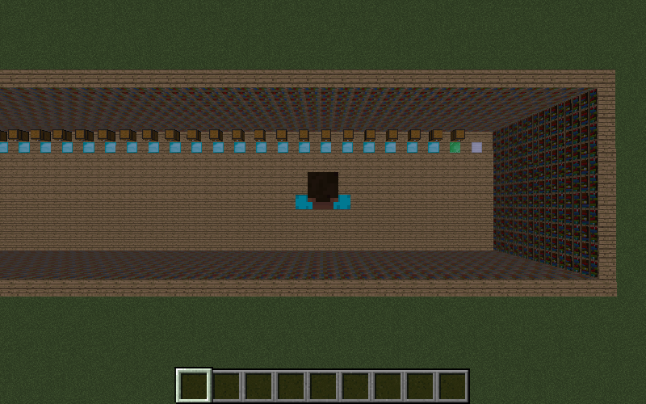

## Video

<iframe width="1000px" src="https://www.youtube.com/embed/4VZZbxWL8jA" frameborder="0" allow="accelerometer; autoplay; clipboard-write; encrypted-media; gyroscope; picture-in-picture" allowfullscreen style="display: flex;margin-left: auto;margin-right: auto;"/>

## Project Summary
The goal of our project is to train a Minecraft agent to navigate an environment consisting of a row of n chests and 
1 goal chest to retrieve and store items in an efficient manner given a distribution of items. The distribution will 
be determined by a "simulated user" who will send retrieval and storage commands to the agent. The result of the 
retrieval commands will accumulate in the goal chest.  To do this the agent must optimize the placement of these 
items based on the retrieval requirements of the items. The final goal of this project would be to create an agent 
which can effectively store and retrieve items with the least amount of delays moving items around to optimize 
retrieval for each request.

## Approach
Our environment was a straight line of chests which each contain a random amount of distributed items. Each "type" of 
chest is marked by the block in front of it on the floor (see below); 
as follows: 
- Iron = mission complete (no chest)
- Emerald = result chest (chest to deposit the request after completion)
- Diamond = deposited chest (chest to hold some unspecified amount of items)

Our agent is setup with several pieces of information and a simple action set. In terms of information, the agent has 
the probability distribution of the items passed, and has the ability to take a few discrete actions -- move left/right,
open/close chests and pick up certain items. 
 
Our current approach is using a greedy algorithm to minimize the steps to get the result. Our current algorithm 
supports a single retrieval step and gathers the correct amount of requested goods from the simulated user requests. 
By using this algorithm we have set a baseline heuristic in order to complete our retrieval goal. Our agent only has
knowledge of the chest contents and it's own inventory contents. Based on these two observations and the simulated 
users goal value the agent searches through the chests to find the correct amount of materials in the chest. As the
agent moves through the chests it takes the required amount of materials that the goal user asked for until it has 
reached the goal value. This approach currently doesn't support swapping items in chests to make future runs faster 
which is one of the things planned for the future. The current setup and heuristic only being the user simulated goal 
is also something we need to work on and we will be adding more heuristics in order to improve the search capability. 
The current actions are agent can do is open and close chests take items in and out of the chests and place them into 
the goal chest at the end of its mission. 

## Evaluation

### Qualitative
To support our method as well as show clear signs where we can improve the method we ran our test which consisted of a 
simulated user giving one command to gather a certain amount of materials 100 times and compared this to a normalized 
based on the amount of items requested and the distribution of the materials. Our agent manages to properly retrieve 
the items of the request and returns them to the chest, fulfilling our qualitative requirements setup.

As you can see below, depending on what is requested for (see the "Retrieving..." section of the 1st screenshot), 
it can pick the selections needed and will ultimately distribute it to the result chest (see the second screenshot ).
This is our first qualitative runtime test, testing that it can properly perform given a single request, issued for a 
single item over a simple test case.

In a more complex (and practical) case, we also are able to respond to multiple requests for multiple materials, shown
in the photo below during collection, and after results are placed in the resulting chest  

### Quantitative
In terms of quantitative analysis, we did a plot of the runtime performance. How exactly we scored the system was as 
follows:  
- Every step has a score of 1  
To calculate the score we used the following formula to normalize it for all inputs:  
$$ \sum_x\frac{(score)(P_x)}{(n_x)} $$  
Where 
- score = score of steps
- P_x = probability of given item x to be selected (given to us as the probability distribution)
- n_x = number of times given item x was requested

The runtime graph is shown below, however, due to the lack of optimizations it seems eratic and spikes every so often 
without any improvements -- definitely a place for improvement.

## Future Plans
Currently, we have essentially created a very simple case that would (theoretically) be the fastest traversal over all 
chests. However, in the future, we plan on implementing two key changes -- first our runtimes will be over a selected
time frame, and the agent will be allowed to "remember" their past actions. Second, we plan on implementing a new 
approach -- we have been looking into the Multi-Armed Bandit problem for possible implementation ideas, and other
exploration vs exploitation possible traversal algorithms that may assist in our algorithm to help with creating 
improvement.

Below is a graph with a new scoring system, adding penalty for opening chests to encourage more direct findings of 
better chests to choose from, and subsequently better results.

## Resources
We used some malmo documentation found in [here for XML](https://microsoft.github.io/malmo/0.21.0/Schemas/MissionHandlers.html) and 
[for agents](http://microsoft.github.io/malmo/0.30.0/Documentation/annotated.html) 

For the Multi-Armed Bandit problem, see [here](https://towardsdatascience.com/solving-the-multi-armed-bandit-problem-b72de40db97c)
for an excellent explanation

Also, a great deal of thanks to Professor Singh and his wonderful TA Mr.Nottingham for providing guidance, and all those
who contributed to Campus Wire
